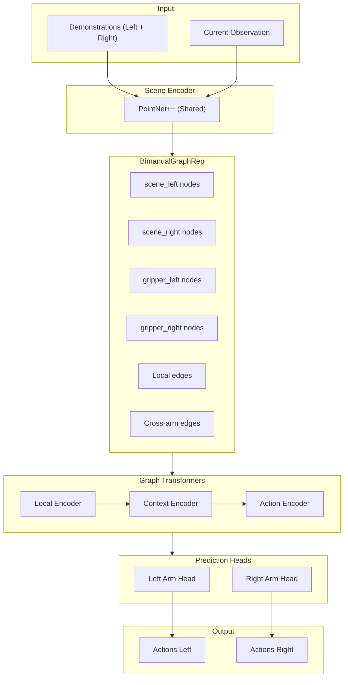
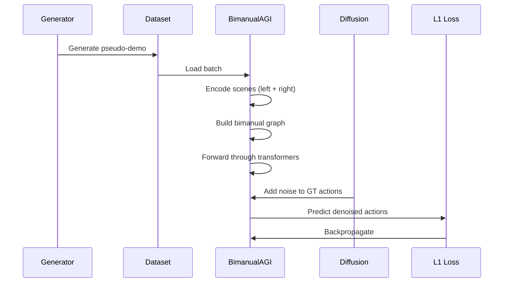
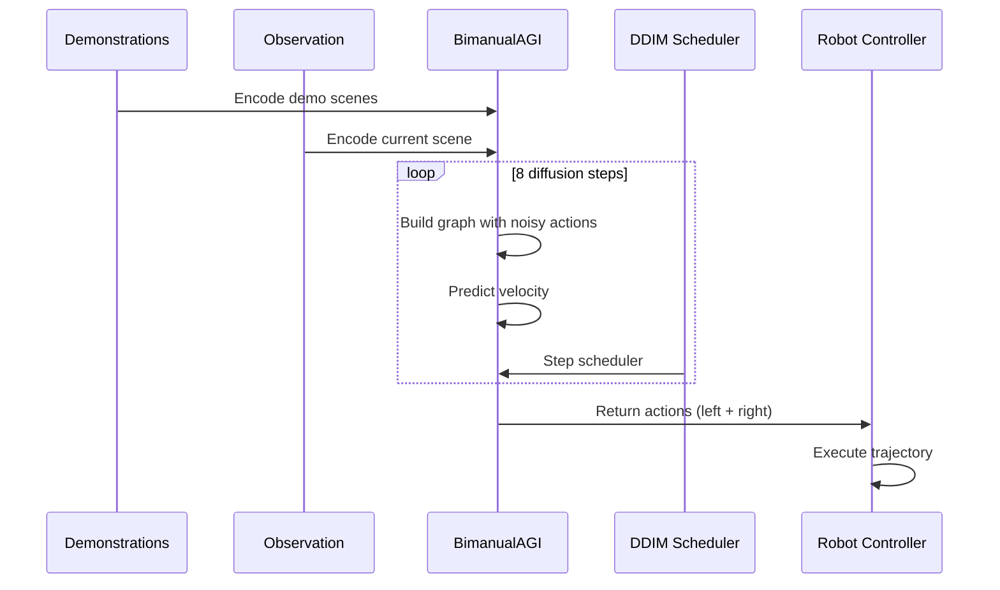

# Bimanual Instant Policy - Implementation Complete

This document summarizes the complete implementation of the bimanual extension for Instant Policy.

## Implementation Status: ✅ Complete

All components have been implemented and the extension is ready for training and deployment.

---

## Files Created

### Core Architecture

| File                                                                                                  | Purpose                                    | Lines |
| ----------------------------------------------------------------------------------------------------- | ------------------------------------------ | ----- |
| [bimanual_graph_rep.py](file:///c:/Users/srini/Desktop/bimanual_instant_policy/bimanual_graph_rep.py) | Dual egocentric graph with cross-arm edges | ~790  |
| [bimanual_model.py](file:///c:/Users/srini/Desktop/bimanual_instant_policy/bimanual_model.py)         | BimanualAGI model class                    | ~400  |
| [bimanual_diffusion.py](file:///c:/Users/srini/Desktop/bimanual_instant_policy/bimanual_diffusion.py) | DDIM diffusion for dual arms               | ~350  |
| [data_structures.py](file:///c:/Users/srini/Desktop/bimanual_instant_policy/data_structures.py)       | Core data types                            | ~240  |

### Pseudo-Demo Generation

| File                                                                                                                          | Purpose                         | Lines |
| ----------------------------------------------------------------------------------------------------------------------------- | ------------------------------- | ----- |
| [objects.py](file:///c:/Users/srini/Desktop/bimanual_instant_policy/objects.py)                                               | Procedural 3D object generation | ~400  |
| [patterns/coordination_patterns.py](file:///c:/Users/srini/Desktop/bimanual_instant_policy/patterns/coordination_patterns.py) | 4 coordination patterns         | ~450  |
| [generator.py](file:///c:/Users/srini/Desktop/bimanual_instant_policy/generator.py)                                           | Full pseudo-demo pipeline       | ~560  |

### Training & Deployment

| File                                                                                                        | Purpose          | Lines |
| ----------------------------------------------------------------------------------------------------------- | ---------------- | ----- |
| [bimanual_dataset.py](file:///c:/Users/srini/Desktop/bimanual_instant_policy/bimanual_dataset.py)           | Dataset classes  | ~340  |
| [bimanual_train.py](file:///c:/Users/srini/Desktop/bimanual_instant_policy/bimanual_train.py)               | Training script  | ~200  |
| [bimanual_prepare_data.py](file:///c:/Users/srini/Desktop/bimanual_instant_policy/bimanual_prepare_data.py) | Data preparation | ~280  |
| [bimanual_deployment.py](file:///c:/Users/srini/Desktop/bimanual_instant_policy/bimanual_deployment.py)     | Inference script | ~300  |

### Configuration

| File                                                                                                                  | Purpose                |
| --------------------------------------------------------------------------------------------------------------------- | ---------------------- |
| [ip/configs/bimanual_config.py](file:///c:/Users/srini/Desktop/bimanual_instant_policy/ip/configs/bimanual_config.py) | Bimanual configuration |

---

## Architecture



---

## Procedural Objects

The `objects.py` module generates 7 types of 3D objects:

| Object   | Description          | Key Dimensions             |
| -------- | -------------------- | -------------------------- |
| Box      | Cuboid               | width, height, depth       |
| Cylinder | Straight cylinder    | radius, height             |
| Sphere   | Uniform sphere       | radius                     |
| Tray     | Hollow container     | width, length, height      |
| Plate    | Flat circular        | radius, thickness          |
| Bottle   | Cylinder with neck   | radius, height, neck_ratio |
| Mug      | Cylinder with handle | radius, height             |

---

## Coordination Patterns

Four patterns for diverse training data:

### 1. Symmetric Lift (30%)
Both arms grip and lift an object together.

```
Time:  0%    20%    30%    70%    100%
Left:  Home → Above → Grasp → Lift → Hold
Right: Home → Above → Grasp → Lift → Hold
```

### 2. Handover (25%)
One arm picks up and passes to the other.

```
Time:  0%    20%    50%    70%    100%
Left:  Home → Pick  → Move  → Release → Home
Right: Home → Wait  → Meet  → Grasp   → Away
```

### 3. Hold and Manipulate (25%)
One arm holds while the other works.

```
Time:  0%    25%    40%    85%    100%
Left:  Home → Grasp → Hold ────────→ Release
Right: Home → Wait  → Work → Work  → Home
```

### 4. Independent (20%)
Arms work on separate objects.

```
Time:  0%    35%    70%    100%
Left:  Home → Pick  → Place → Home
Right: Home → Pick  → Place → Home (offset timing)
```

---

## Data Flow

### Training



### Inference



---

## Quick Start

### 1. Generate Training Data

```bash
python bimanual_prepare_data.py generate \
    --output_dir ./data/pseudo_demos \
    --num_samples 10000
```

### 2. Train

```bash
python bimanual_train.py \
    --run_name bimanual_v1 \
    --batch_size 8 \
    --use_pseudo_demos 1
```

### 3. Deploy

```bash
python bimanual_deployment.py \
    --checkpoint ./checkpoints/bimanual_v1/best.pt
```

---

## Testing

Run component tests:

```bash
python test_components.py
```

Expected output:

```
============================================================
BIMANUAL INSTANT POLICY - COMPONENT TESTS
============================================================

  Procedural Objects: ✓ PASSED
  Coordination Patterns: ✓ PASSED
  Pseudo-Demo Generator: ✓ PASSED
  Data Structures: ✓ PASSED
  Graph Representation: ✓ PASSED
  Bimanual Model: ✓ PASSED

ALL TESTS PASSED!
```

---

## Key Design Decisions

### 1. Shared Scene Encoder
Both arms use the same PointNet++ encoder (configurable). This:
- Reduces parameters by ~50%
- Ensures consistent scene representations
- Can be separate if needed via `shared_scene_encoder: False`

### 2. Dual Egocentric Frames
Each arm sees the scene from its own perspective. Benefits:
- Pose-invariant representations
- Natural handling of relative motions
- Consistent with single-arm IP

### 3. Cross-Arm Edges
Three types connect left and right gripper nodes:
- `cross`: Current timestep coordination
- `cross_action`: Action-level coordination
- `cross_demo`: Demo-level coordination

### 4. Separate Prediction Heads
Each arm has its own translation, rotation, and gripper heads:
- Allows asymmetric predictions
- Can be conditioned on coordination pattern
- Maintains independence when needed

---

## Next Steps

1. **Train on real data**: Fine-tune from pseudo-demos on actual robot demonstrations
2. **Optimize inference**: Enable model compilation for real-time performance
3. **Add patterns**: Implement task-specific coordination patterns
4. **Hardware integration**: Connect to actual bimanual robot system

---

## Summary

The bimanual extension is **complete** and includes:

- ✅ Dual egocentric graph representation
- ✅ Cross-arm attention in transformers
- ✅ Procedural object generation
- ✅ 4 coordination patterns
- ✅ Full pseudo-demo pipeline
- ✅ BimanualAGI model
- ✅ Bimanual diffusion training
- ✅ Dataset utilities
- ✅ Training script
- ✅ Deployment script
- ✅ Component tests
